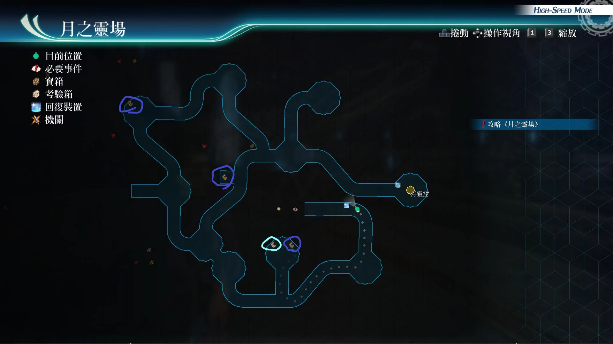

# 月之灵场

---

## 月之灵场·前段

- [ ] 勇气灵魂
- [ ] 极光衣
- [ ] 还魂胶囊

## 月之灵场·后段

- [ ] 白银狼R
- [ ] 幻月鞋
- [ ] 龙神香

## 考验宝箱

月之灵场·前段

- [考验箱023](/game/TheLegendOfHeroes/SenNoKiseki4/ordeal/023.md)

## 战斗笔记

- [ ] 双重镰刀手
- [ ] 奇月蠓
- [ ] 银月软体兽
- [ ] 红月软体兽
- [ ] 噬魂者
- [ ] 深渊月虫
- [ ] 深渊克洛提德
- [ ] 奥蕾莉亚分校长
- [ ] 灼兽罗赛莉亚

## 钓鱼笔记

## Boss

*深渊克洛提德*

攻击手段
- 魔剑舞踏：范围攻击
- 无间冰狱：范围冻结
- 瞬发失落魔法（冰柱陨星）：全员全能力下降
- 瞬发失落魔法（日珥嘶吼）：全体加全取消和炎伤
- 减少30%的体力后，会概率释放S技
- S技（深渊苍蓝之歌）：全屏魔法攻击(但是物理判定，墙有效)
- 半血后break槽会强制恢复正常
- 半血后会进入亢奋状态，然后再次使用S技
- 10%hp左右，又会亢奋
- 依旧会瞬发失落魔法

建议打法：

可以全程开艾玛的指令，令大部分攻击无效。接着上好坚韧守护即可。然后我方，带上菲或亚尔缇娜，使用隐匿战技，回复bp，保证指令效果不断。然后弱点解析后，慢慢打即可，记得让某人装备纹章，把她打崩后，再给予最后一击，这样获得的回路数量是2倍

建议打法2：

可以选择，用亚修的指令然后弱点解析，刷链接攻击即可。上好新月镜和坚韧守护，或者尤西斯白金盾，然后黎恩螺旋击，慢慢打即可

建议打法3：

套好新月镜后，法师们带好宝盒，开劳拉指令，爆失落魔法和白银狼，顺便爆s，之后悠娜拉人即可。女神之吻后，再次S技送上

---

*奥蕾莉亚分校长*

攻击手段
- 蓄力战技（霸王斩）：直线带str和ats下降
- 四耀剑：范围加石化，冻结，炎伤和睡眠。魔法攻击（但是物理判定，墙有用。）
- 50%hp，或10%hp左右会使用武神功：进入亢奋状态，以及增加str，ats，spd，附加3回合剑闪效果
- 会驱动魔法：大回复术
- S技（王技剑乱舞踏）：全体加全能力下降
- 半血后强制回满所有break槽

建议打法

开着黎恩的玄武阵，亚莉莎用天堂赠礼，上好坚韧守护，新月镜套上def上升，或者尤西斯的白金盾，全程即可硬刚，完全没有难度。法师依旧可以使用，各种核心回路搭配各铃铛轰。她亢奋状态的S技可以用墙挡。可以用悠娜加马奇亚斯，亚莉莎或艾玛或亚尔缇娜，搭配盖乌斯S技，形成无限动流。之后他只要被悠娜或者，马奇亚斯拉上来即可。马奇亚斯悠娜两人都装备，永恒做副核心回路以及，装备时爆，盖乌斯装备时爆卖血恢复cp，继续扔S技，没血了，让悠娜扔回复药即可。或者亚莉莎，艾玛，亚尔缇娜回血即可，用盖乌斯S技，对面就动不了。不过输出主力就只有他一人

建议打法2

闪避3人众反击流，菲和莎拉和库尔特堆满闪避，辅助核心回路装备天狼，回路装备愤怒，让亚莉莎用天堂赠礼。分校长也打不到人，也是很不错的

建议打法3

上好强音之力.复，开劳拉指令，全员爆S，之后悠娜拉人。然后女神之吻，继续爆S

---

*灼兽罗赛莉亚*

攻击手段
- 开场就会使用：永劫灼焰：之后我方每次行动，就会消耗10%hp，无法用道具恢复此异常状态，但可以进行回血，一定回合内，效果结束
- 辉翔闪风：直线：黑暗
- 业炎奔流：直线全取消
- 乐土焰华：范围加混乱
- 黑暗中发光之眼：范围石化，即死，黑暗，墙和镜都没用，只能绝对防御，或者装备防即死和石化饰品
- 减少30%体力后会使用吾乃司掌终焉引发肇端之命运
- 半血后会亢奋，下1个回合使用吾乃司掌终焉引发肇端之命运
- 吾乃司掌终焉引发肇端之命运：全体炎伤。物理攻击。墙有效

建议打法1

装备防混乱和石化装备。全程开着艾玛指令，这样除了终焉命运，永劫灼焰的持续掉血效果，以及发光眼的异常外，其他攻击都可以帮我们回血。然后开着坚韧守护，或者尤西斯的白金盾即可。之后带上盖乌斯加双拉，永久永动流，对面依旧动不了。可以开减伤阵，加新月镜，闪耀天启，正面硬刚也可以。尤西斯的场合，白金盾不断即可，然后我方一直开着，尤西斯指令的状态，进行输出。也可以开黎恩的黄龙阵，或者亚修指令，搭配螺旋击，亚修10cp换60cp，库尔特暴雨斩也可以。只要它的体力，只剩下70%后，记得上墙

建议打法2

黎恩装备神矛，时间爆发妙婕指令，螺旋击和普通攻击换着打即可

建议打法3

黎恩鬼气解放，劳拉指令后S技，其他人爆S，之后后排爆S，拉人的负责拉人上来，女神之吻继续爆S，然后继续拉人即可