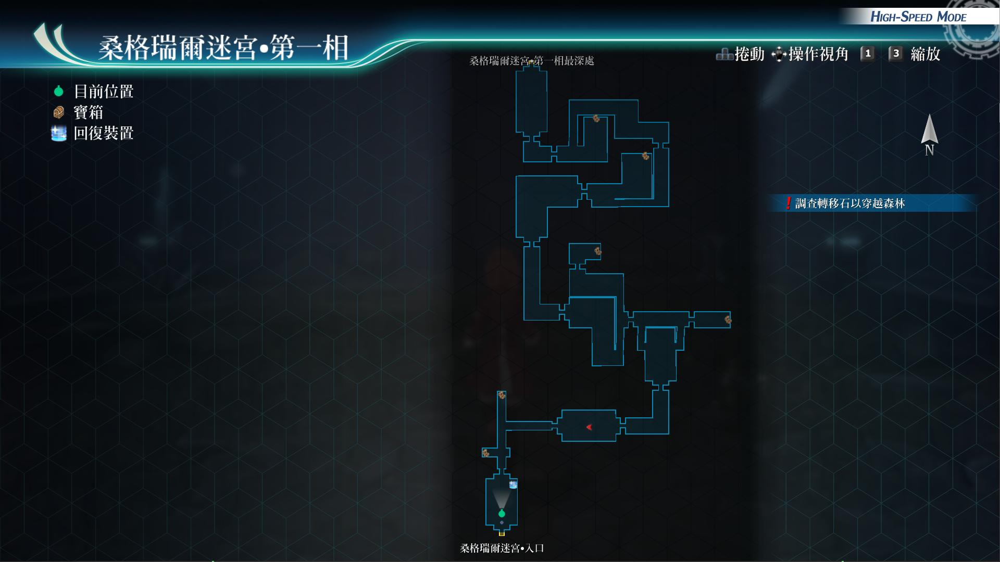
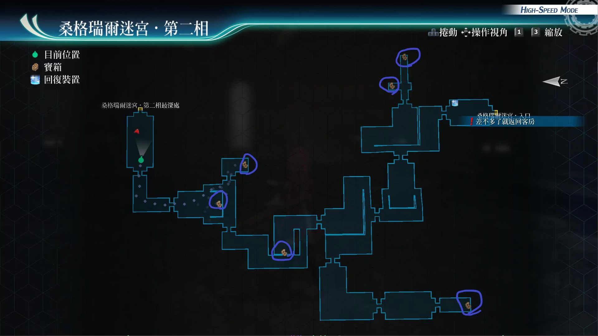
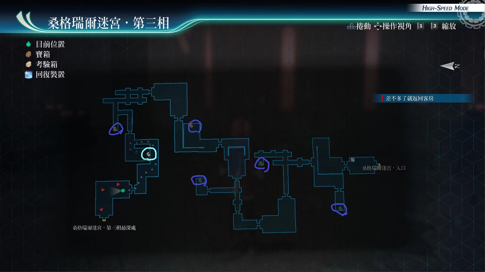
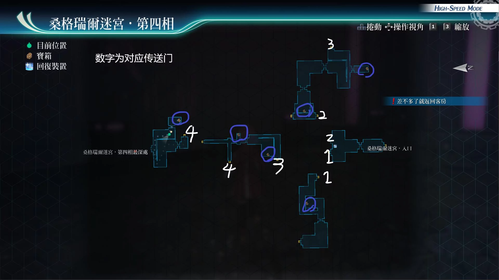

# 桑格瑞尔迷宫

---

## 桑格瑞尔迷宫·第一相

- [ ] 中回复药, EP填充剂2, 圣灵药
- [ ] 银之链
- [ ] 七属性耀晶片x50
- [ ] HP2
- [ ] 精灵香
- [ ] 替身傀儡

## 桑格瑞尔迷宫·第二相

- [ ] U物质x5
- [ ] 力量药水, 守护药水, 守护药水
- [ ] 黄色坠饰
- [ ] 痊愈之药x5, S-药片x5
- [ ] 七属性耀晶片x50
- [ ] 七属性耀晶片x50

## 桑格瑞尔迷宫·第三相

- [ ] U物质x5
- [ ] 时间爆发R
- [ ] 中回复药, EP填充剂II, 圣灵药
- [ ] 黑色坠饰
- [ ] 七属性耀晶片x50

## 桑格瑞尔迷宫·第四相

- [ ] EP3
- [ ] 驱动3
- [ ] U物质x5
- [ ] 闪焰蝶R
- [ ] 七属性耀晶片x50
- [ ] 勇气种子

## 考验宝箱

桑格瑞尔迷宫·第三相
- [考验箱007](/game/TheLegendOfHeroes/SenNoKiseki4/ordeal/007.md)

## 战斗笔记

- [ ] 悲凄者
- [ ] 霉菌水母
- [ ] 蒙面法师
- [ ] 邪尘魔
- [ ] 绯之罗赛莉亚
- [ ] 吸血蝙蝠
- [ ] 噬光血鱼
- [ ] 挥刀人像
- [ ] 石像鬼
- [ ] 奇雉蠓
- [ ] 刺须水螅
- [ ] 毒灰魔
- [ ] 巨海怪
- [ ] 八爪魔蛸
- [ ] 终极体
- [ ] 胧雾影
- [ ] 阿拉克涅·格莱亚

## Boss

*绯之罗赛莉亚*

需调查：绯之罗赛莉亚

目标条件：把罗赛莉亚的血量减少到50%

隐藏条件：直到最后都全员生还，*AP+3*

绯之罗赛莉亚攻击手段：

- 染血牙：全近距离范围攻击或者单体攻击，可吸收我方hp，回复她的hp以及cp
- 绯红枪刺：直线范围攻击
- 被打到只剩下50%的hp后，会亢奋，之后是释放，全屏S技终极魔法红月，必须在正面吃到这招的状态下，我方全员没有任何一个人战斗不能才行。ps：亚尔缇娜的指令无效

推荐打法：

悠娜装备宝箱开出的hp2回路，亚尔缇娜装备银之链，库尔特装备

继承闪3通关存档获得的加血配件。然后悠娜，给我方全员上闪耀天启

兰迪上强音之力，然后开自己的指令，之后爆S技，之后负责使用卖血战技战嚎

来回复cp，之后再爆S，这个流程。亚尔缇娜不输出，专门负责兰迪的回血和回cp

并且适当的放一下战技，弱点识破，方便刷连接攻击。库尔特释放第1个战技，暴雨斩

或者留着cp，等兰迪指令爆S也可以，因为兰迪指令有，str加45%1回合这个效果

主输出是兰迪，还有看罗赛的血量快看到红线的话，尽量把我方全员的hp回满

并且让悠娜使用结晶防护.复，来防止s技秒杀我方一名人员

*石像鬼*

攻击手段
- 突风技能：范围攻击
- 驱动魔法（刺藤爪）：圆M范围，中毒和石化
- 驱动魔法（巨石陨落）：大范围带def下降
- 半血后会亢奋
- 蓄力战技（烈风）：直线带adf下降

建议打法

装备好防中毒和石化饰品。或者角色全部用带解驱动战技的角色

可以开场带新七四人，亚尔缇娜用完弱点解析后。可以换成莎拉或者菲，不用带艾略特也可以

因为这怪弱斩属性，突属性，射属性。调查完之后，链接攻击出率，就比较高。悠娜先动的话

开菲指令，然后用拉人战技，之后烈焰之心以及上强音之力，即可。库尔特依旧时间驱动

之后暴雨斩。亚修用10cp战技换100cp战技。亚尔缇娜换成菲，或者莎拉后。如果是菲

先用隐匿加攻战技。莎拉的话优先用雷神功。之后把boss的break槽减低到一半后

开悠娜指令或者亚修指令。亚修用恶魔锁链：消耗60cp，SS破break槽战技。之后

boss很快被打入break状态。然后如果我方只有1人能行动，BP有5，然后能动的角色

不是悠娜的话，就莎拉指令，适当打一会儿之后，悠娜再拉人。bp有3就菲指令

各种刷链接攻击即可，收尾前开亚修指令，之后S技即可

*阿拉克涅·格莱亚*

需调查：阿拉克涅·格莱亚

攻击手段
- 普通攻击：吸收HP
- 蜘蛛丝：范围MOV/SPD下降
- 疯狂呐喊：全体混乱，DEF/ADF下降，驱动解除
- 昏睡邪眼：单体恶梦
- 半血后亢奋
- 蓄力战技（即死邪眼）：单体即死

建议打法

全程新月镜，装备防混乱和即死的饰品，开妙婕指令，法师时间爆发，放空属性魔法