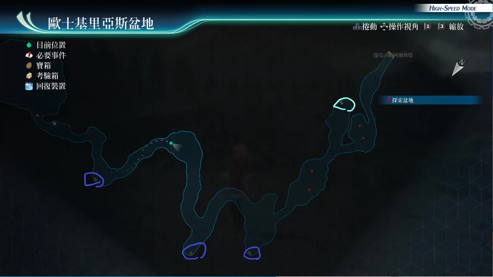
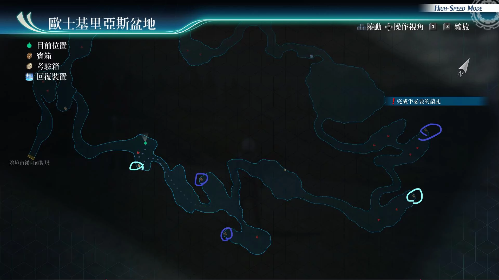

# 欧士基里亚斯盆地

---

## 欧士基里亚斯盆地1

- [ ] 封技之刃II
- [ ] 修复石, 激发石, 勇气石, 复生石
- [ ] 还魂粉

## 欧士基里亚斯盆地2

- [ ] 安洁莉卡的假发
- [ ] 冰冷皮带扣
- [ ] 粗碎岩盐x5, 千万五壳x5, 百万精酒x5

## 考验宝箱

- [考验箱006](/game/TheLegendOfHeroes/SenNoKiseki4/ordeal/006.md)
- [考验箱016](/game/TheLegendOfHeroes/SenNoKiseki4/ordeal/016.md)
- [考验箱017](/game/TheLegendOfHeroes/SenNoKiseki4/ordeal/017.md)

## 战斗笔记

- [ ] 硬壳甲虫
- [ ] 街灯蜘蛛
- [ ] 烈火螳螂
- [ ] 死亡蝎
- [ ] 蝎王
- [ ] 弗利兹
- [ ] 艾妲
- [ ] 战鬼谢莉
- [ ] 塞德利克皇太子
- [ ] 光辉鼠
- [ ] 灾厄黄蜂
- [ ] 草地多头龙
- [ ] 耀晶石野牛
- [ ] 巨型胡蜂
- [ ] 红焰象

## Boss

*塞德利克皇太子*, *艾妲*, *弗利兹*, *战鬼谢莉*

需调查：塞德利克皇太子, 艾妲, 弗利兹, 谢莉

胜利条件：把所有敌人的体力降到红线以下

?> 隐藏AP：在40回合内，把敌方全员体力都降到红线以下 *AP+3*

艾坦攻击手段
- 普通攻击带链接攻击
- 驱动魔法（冰晶剑）：直线范围带冻结
- 蓄力战技（干燥球体）：范围概率带连接攻击，连续猛攻，带炎伤或冻结或封技状态
- 蓄力战技（盘旋大鹭）：直线攻击
- 会驱动中回复术，要优先打掉

弗利兹攻击手段
- 普通攻击带链接攻击
- 蓄力战技（烈剑猛袭）：范围带连接攻击，连续猛攻，带炎伤
- 钢铁之门：自身增加1次绝对防御

赛德利克攻击手段
- 普通攻击：带链接攻击，理念攻击，爆烈猛攻
- 溶解切刀：单体加炎伤，带连接攻击或者理念攻击
- 避邪剑：范围加炎伤
- 驱动魔法（猛毒烈焰）：范围中毒加炎伤
- S技（炼狱剑）：全体加炎伤

谢莉攻击手段
- 普通攻击：带链接攻击，理念攻击，爆裂猛攻
- 烈焰冲锋：大范围加炎伤
- 杀戮扫射：大范围加概率连接攻击，即死
- 蓄力战技（致命风暴）：直线小范围加既死
- 蓄力战技（血腥十字）：单体加既死

建议打法

防既死和炎伤饰品必备。因为调查情报要4个回合，最多也就36个回合

开场如果妙婕先动，立马换成菲，然后菲开强音之力·复

之后另外两人（库尔特和亚修） 爆S，悠娜开菲指令，再用战技把其他三人拉上来

之后其他3人，只管调查情报即可，优先调查艾妲和弗利兹

菲暂时不放S。之后用库尔特换上，亚尔缇娜，亚尔缇娜回复我方cp

菲使用隐匿技能，链接攻击回复bp，套上强音之力复之后，再开亚修指令

菲再爆S，没cp的那个人换成亚修，亚修一个10cp回复100cp，再吃个还魂粉

再200cpS技，之后妙婕再S，这样基本就能在40个回合内搞定

*绯之骑神特斯塔·罗莎*

弱点
- 普通状态：头部
- 右手拿剑的架势驱动（溶解切刀：单体带炎伤）：手臂
- 身体往下蹲着的状态（魔弓恶魔公爵：带延迟）：身体

建议打法

亚修带你所带的旧七，库尔特带妙婕，悠娜带亚尔缇娜

由于绯骑速度很快，我方需查看红色指针，指向谁，谁就防御即可

然后悠娜有2点bp就使用必杀技，亚尔缇娜给绯骑加spd下降的debuff，这是基础

如果带了菲，菲给亚修加spd上升大，亚修就趁着这个机会输出

如果带了莎拉，莎拉只管扔鸣神。带了艾略特则使用回血魔法即可

没血了记得防御或者神气，配合妙婕的蓝宝石雨回血。然后库尔特暴雨斩

配合亚修的空虚破坏者。库尔特有2点bp记得放必杀，降低绯骑的str。很快就过了

*火焰象*

攻击手段
- 普通攻击：范围攻击
- 暴君之嚎：范围带晕厥和延迟，和概率解除驱动
- 骑乘猛踏：直线def下降和晕厥
- 45%hp或者15%hp，会使用巨兽觉醒，进入5回合亢奋状态，恢复hp
- 蓄力战技（火山爆发）：全屏带炎伤，必中
- 驱动魔法（七圣剑）：全屏带任意异常状态

建议打法1

带亚莉莎，亚尔缇娜，艾玛。然后全程开着艾玛的指令，这样除了骑乘猛踏和普通攻击，其他攻击都是帮我们回血的。带上防晕厥饰品，亚尔缇娜使用回cp技堆def上升，亚莉莎使用天堂赠礼，艾玛使用月之气息，或者带上宝盒，开水魔法轰，黎恩则使用螺旋击，没多久幻兽就跪了。

建议打法2

带上盖乌斯，S技延迟加双拉即可。回cp任务交给亚尔缇娜，艾玛或者亚莉莎

建议打法3

妙婕指令，然后黎恩装备神矛运转，时间爆发，带上回cp3人组，螺旋击输出即可，艾玛的S技可以防止翻车，但还是推荐上个新月镜