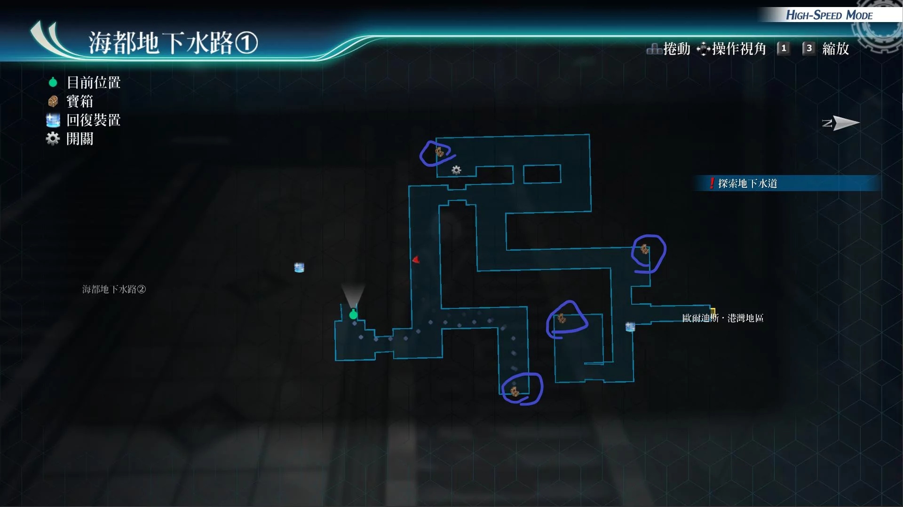
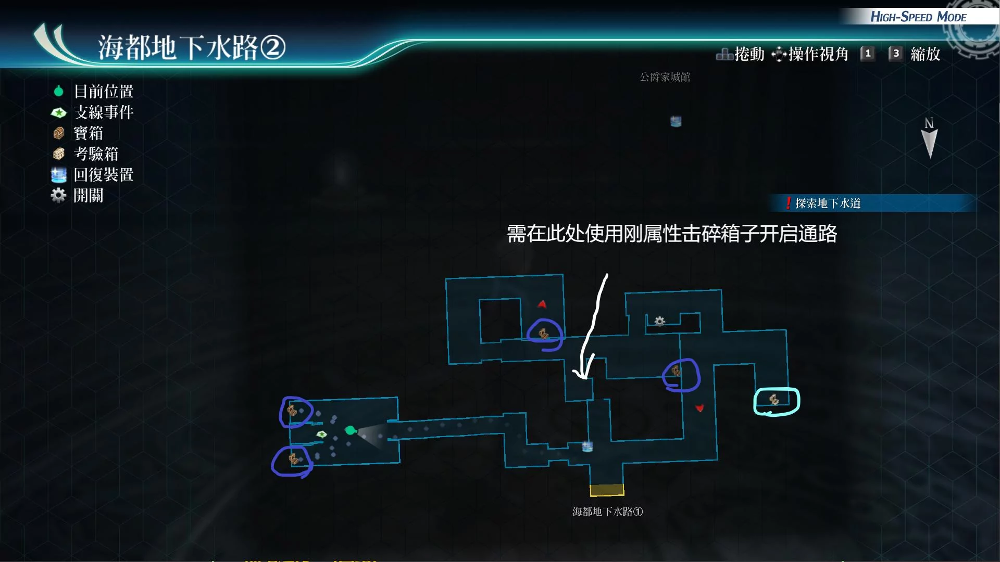

# 海都地下水路

---

## 海都地下水路1

- [ ] 清爽头带
- [ ] 七属性耀晶片x100
- [ ] 勇气种子
- [ ] 盖伦堡垒R

## 海都地下水路2

- [ ] 精灵香
- [ ] 大回复术R
- [ ] 黑暗之刃II
- [ ] 还魂粉

## 考验宝箱

海都地下水路2

- [考验箱015](/game/TheLegendOfHeroes/SenNoKiseki4/ordeal/015.md)

## 战斗笔记

- [ ] 鲜红狂鲨
- [ ] 古墓甲壳虫
- [ ] 卫士队队员
- [ ] 深海海星
- [ ] 杀戮魔草
- [ ] 卫士队队员
- [ ] TMP队员
- [ ] 恩格斯上尉
- [ ] 克蕾雅少校
- [ ] 红之罗丝薇瑟

## 钓鱼笔记

## Boss

*卫士队员*x4

有两种卫士队员，都需要调查

棕发攻击手段
- 驱动魔法（猛毒烈焰）：范围带炎伤和中毒
- 驱动魔法：强音之力·复
- 驱动大治愈术和中回复术
- 蓄力战技（加速斩击）：单体攻击

黄发攻击手段
- 驱动魔法（刺藤爪）：范围带石化和中毒
- 驱动魔法：结晶防护·复
- 驱动魔法：大治愈术和中回复术
- 蓄力战技（加速斩击）：单体技

建议打法1

带了亚修和菲的状态下，时间爆发后都用即死技能，对面就没了

建议打法2

此战上个闪耀天启，新月之镜，带上艾玛，亚尔缇娜或亚莉莎，黎恩开减伤阵正面刚即可

建议打法3

妙婕带水铃铛带自己的核心回路，开神乐阵或者自己的指令，用冰晶剑轰。之后其他伙伴，装备运转堆str，开亚修阵爆S，之后马奇亚斯时爆拉人，我方再女神之吻，再爆S，这样敌方全程不能动就结束了