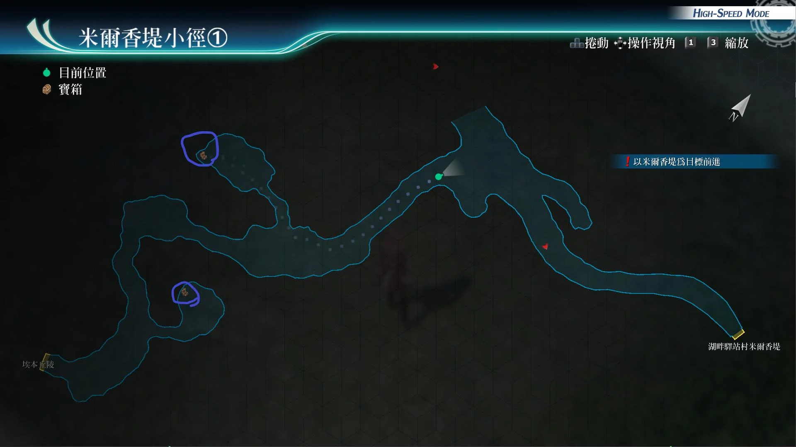
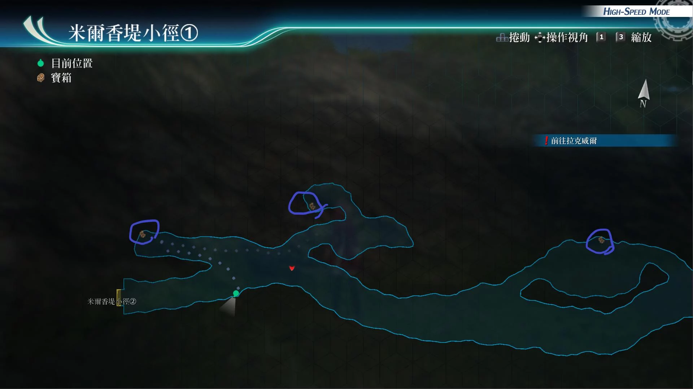
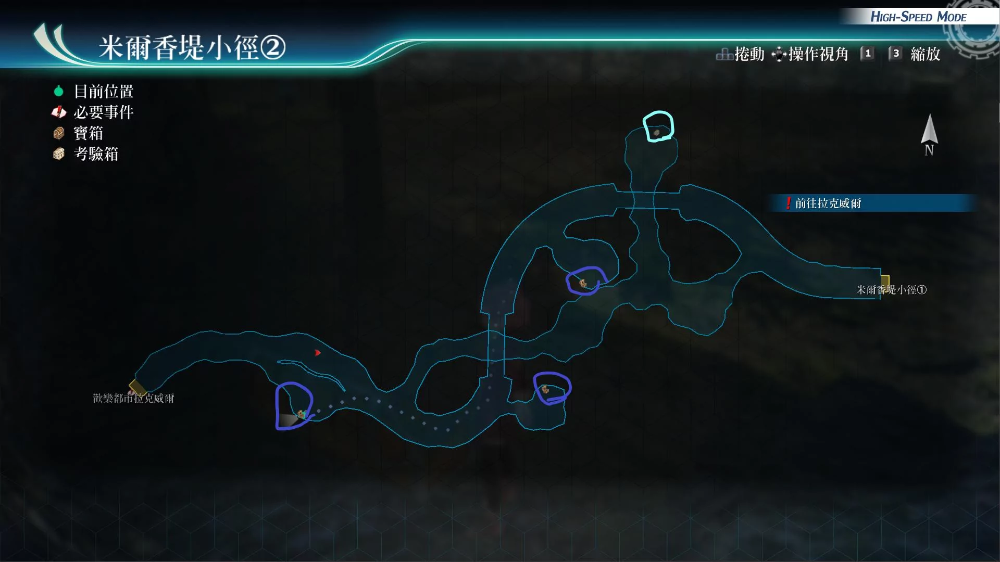

# 米尔香提小径

---

## 米尔香提小径1

- [ ] 七属性耀晶片x50
- [ ] 虹彩斗篷

## 米尔香提小径1 (月灵窟之后)

- [ ] 时间驱动R
- [ ] 混乱之刃
- [ ] 新鲜香草x5, 爽口洋葱x5, 爽口洋葱x5

## 米尔香缇小径2

- [ ] 刺藤爪R
- [ ] U物质x5
- [ ] 痊愈之药x5. S-药片x5

## 考验宝箱

[考验箱005](/game/TheLegendOfHeroes/SenNoKiseki4/ordeal/005.md)

## 战斗笔记

- [ ] 虹彩蚊
- [ ] 犬颈蜻蜓
- [ ] 玻璃软体兽
- [ ] 新种褐翅蠊
- [ ] 命运纺织者
- [ ] 洞穴蜗牛
- [ ] 玉簾

## 钓鱼笔记

## Boss