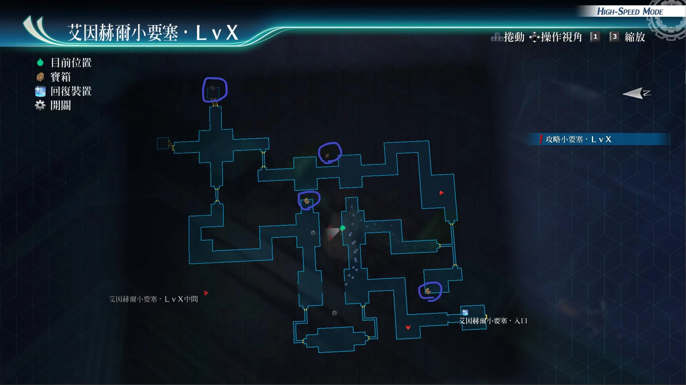
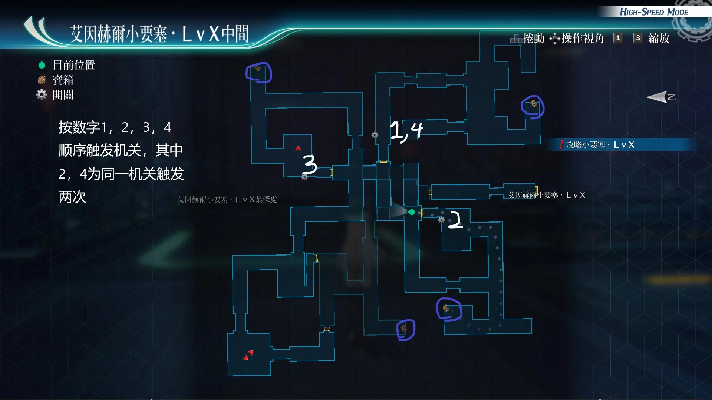

# 艾因赫尔小要塞

---

## 艾因赫尔小要塞·LvX

- [ ] U物质x5
- [ ] 精灵香
- [ ] 樱色胸花
- [ ] 混乱之刃III

## 艾因赫尔小要塞·LvX中间

- [ ] 七属性耀晶片x100
- [ ] 还魂粉
- [ ] 失落创世纪R
- [ ] 大理石幸运符

?> 如果在小要塞LvX·中间迷路，可重置场景，按下面顺序拉开关(小地图北为上)：右下→左下→右上→左下，可参考宝箱地图

## 战斗笔记

- [ ] 三位一体攻击者HG
- [ ] 三位一体攻击者R2
- [ ] 飞行探查机PRO
- [ ] 方阵兵J9
- [ ] 总校女生
- [ ] 总校男生
- [ ] 总校女生
- [ ] 巨触魔草
- [ ] 形态兵器伽罗德
- [ ] 总校男生
- [ ] 总校男生
- [ ] 潜航机炮EX
- [ ] 玉簾S
- [ ] 须佐之男
- [ ] 战斗潜行者EX
- [ ] 艾妲
- [ ] 弗利兹
- [ ] 米海尔教官
- [ ] 潜影枪手G48C
- [ ] 潜影枪手M48C
- [ ] 潜影枪手R48C

## 钓鱼笔记

## Boss

*艾妲*, *弗利兹*, *米海尔教官*

!> 隐藏条件：100回合以内胜利*AP+3*

艾妲攻击手段
- 普通攻击：带链接攻击
- 驱动魔法（冰晶剑）：直线带冻结
- 蓄力战技（干燥球体）：范围概率带连接攻击,连续猛攻,带炎伤或冻结或封技
- 蓄力战技（盘旋大鹫）：直线

弗利兹攻击手段
- 普通攻击:带链接攻击
- 蓄力战技（烈剑猛袭）：范围带连接攻击,连续猛攻,带炎伤
- 钢铁之门：自身增加1次绝对防御
- 结晶防护：提升敌方def
- 强音之力：提升敌方str

米海尔攻击手段
- 开场会使用智慧号令：全员恢复5%hp，并且提升str，ats，spd
- 爆裂幻影：直线范围攻击
- 蓄力战技（猛击机炮）：范围加炎伤
- 半血后会使用不挠之势：进入3回合亢奋状态，并且恢复HP，DEF和ADF上升
- 半血后强制恢复满所有的break槽

建议打法1

调查完情报后开个强音之力·复，开亚修阵或者缇妲阵，然后爆缇妲和兰迪的S技，再爆个鬼气黎恩的S。这样基本对面就只剩下米海尔了。然后悠娜时爆拉人，也可以自己装备永恒，吃1个还魂粉，这样那3人又有S技可以发了

建议打法2

全程开着新月镜、闪耀天启、九重阵即可，亚尔缇娜和缇妲回血回cp，用各种战技输出。缺bp用悠娜的烈焰之心和亚尔缇娜的黑色屏障即可