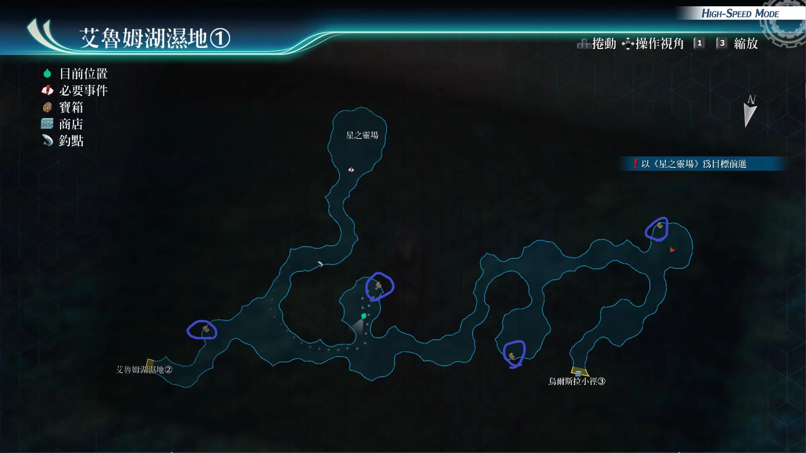
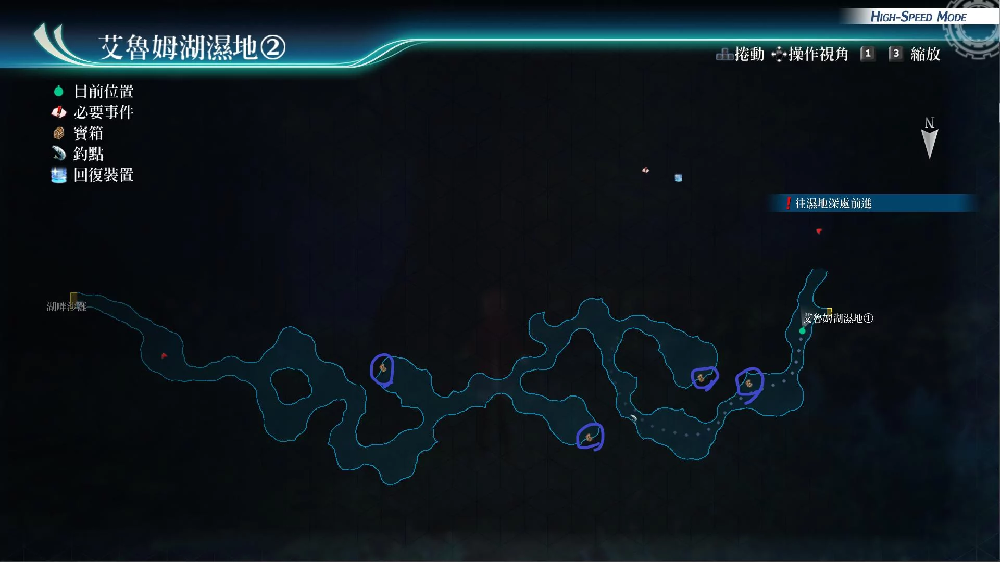

# 艾鲁姆湖湿地

---

## 艾鲁姆湖湿地1

- [ ] 朱雀刃
- [ ] 勇气种子
- [ ] 七属性耀晶片x150
- [ ] 大回复术SR

## 艾鲁姆湖湿地2

- [ ] 暖洋洋袜子
- [ ] 修复石, 激发石, 勇气石, 复生石
- [ ] 新月之镜R
- [ ] 还魂粉

## 战斗笔记

- [ ] 雾中花
- [ ] 寒冰蝶
- [ ] 幼小裸海蝶
- [ ] 莫汐波里
- [ ] 异次元格莱亚
- [ ] 小丑坎帕尼拉
- [ ] 死线克鲁格
- [ ] 雷克多少校
- [ ] 尤诺拉
- [ ] 金属纹白蝶
- [ ] 噩梦魔蛙
- [ ] 次元虫
- [ ] 提阿玛特

## 钓鱼笔记

艾鲁姆湖湿地1有钓鱼点
- 珍珠草鱼

艾鲁姆湖湿地2有钓鱼点，但没有新品种

## Boss

*小丑坎帕尼拉*, *雷克多少校*, *死线克鲁格*

胜利条件：活到最后，40回合内自动结束战斗

!> 隐藏条件：40回合内把所有敌人的体力，降低到红线以下 *AP+3*

小丑攻击手段
- 普通攻击：范围攻击
- 恶梦置换：全屏无伤害但是带有延迟状态，必中
- 特殊变换：使我方的攻击，打到他的场合，会转移到自己的角色上
- 蓄力战技（七珠连击）：大范围带有多种异常状态
- 驱动魔法（神罚怒雷）：范围封技

雷克特攻击手段
- 轮到他行动，开局就会使用指令：喧闹烈焰：4回合内我方不能使用指令，并且使用ep和cp的消耗为2倍
- 蓄力战技（破灭炎剑）：范围带炎伤加恶梦
- 咒卡：必中，单体我方全能力下降，或者单体我方强制即死，无视绝对防御，即死抗性，敌方一人全hp恢复，或敌方一名全能力上升大
- 驱动魔法（猛毒烈焰）：范围中毒炎伤
- S技（赤红骑士）：全体任意异常状态。物理攻击

死线攻击手段
- 缝影：带spd和mov下降
- 灾厄十字：范围加延迟加封技
- 告死蝶：单体既死加全取消，魔法攻击。新月镜无效，艾玛指令才能吸收，或者艾玛S技，尤西斯白金盾才能挡

建议打法1

带着艾玛的状态下，开着艾玛指令，这样就可以先无视小丑的攻击，和女仆的告死蝶，想拿4个0，就第1时间送走雷克特。

雷克特发指令后，我方用战斗测探器调查情报，消耗回合拖过指令，到能开order即可，也可以吃料理给自己上str的buff，艾玛可以爆S。

女仆蓄力一定要打断，如果没有艾玛指令，和S技的话。

封锁解除后，BP满7的状态，套上强音之力.复，物理角色爆S技，悠娜不爆S，时爆拉人，换上后排法师角色，后排法师角色，开艾玛指令，再爆S。再悠娜时爆S即可，轻松过。

建议打法2

没有艾玛的状态。悠娜装备好时间爆发，开妙捷指令，调查3人情报，之后开亚修指令，让其他物理3人爆S，之后拉人战技拉上来，被拉上来的人换成替补成员，加上强音之力或者吃个勇气种子，再开亚修指令全力爆S即可，再切换上悠娜继续拉人，这样就没什么难度。

建议打法3

悠娜时间爆发拉人后，上指令，太刀风之阵改，就这期间输出，之后悠娜时爆继续拉人，以及时爆烈焰之心回复bp，即可。

*魔煌机兵·剑*, *魔煌机兵.枪*

魔煌机兵·剑弱点
- 普通状态：身体
- 剑拿在后方驱动（单体技：畏惧斩击）：手臂

魔煌机兵·枪弱点
- 普通状态：手臂
- 驱动状态（黑暗射击：范围攻击）：头部

建议打法

带悠娜，库尔特，亚修。剑打谁，谁防御。对着魔煌机兵·枪打，即可，没血了妙捷回血，亚莉莎回血，艾玛堆def，悠娜给它们送双生爆破枪，亚尔缇娜给枪扔spd下降魔法，然后满5bp，一个协力技，基本就送走了。

*金色骑神*

胜利条件：把敌方体力降低到50%

弱点
- 普通状态：手臂
- 双手拿剑，水平垂直状态驱动（神谕剑：敌方附加2回合剑闪效果，带链接攻击）：头部
- 单手拿剑状态驱动（灵魂切割者：单体攻击）：身体

建议打法

此战不要盲目打断，不然敌方容易2连动，不要用协力技。打谁谁防御，群体技都防御

悠娜2点bp技上spd下降，亚尔缇娜扔spd下降，妙捷负责回血。之后有2点bp了，库尔特负责上2bp的str下降。之后慢慢磨即可