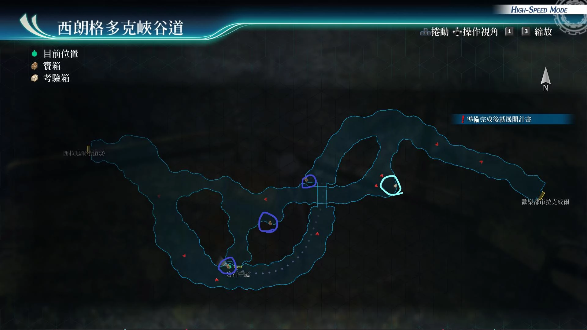

# 西朗格多克峡谷道

---

## 宝箱

- [ ] 新鲜的蛋x10, 鲜奶x10, 熟成乳酪x10
- [ ] U物质x5
- [ ] 破迅之牙III

## 考验宝箱

- [考验箱020](/game/TheLegendOfHeroes/SenNoKiseki4/ordeal/020.md)

## 战斗笔记

- [ ] 袋狸
- [ ] 橡实虫
- [ ] 死亡蠕虫
- [ ] 深渊巨虫
- [ ] 高等枭怪
- [ ] 军刀狮犬
- [ ] 狩猎狮犬
- [ ] 受难长矛手
- [ ] 前北方猎兵(剑)
- [ ] 尼德霍格(剑)
- [ ] 尼德霍格(枪)
- [ ] 前北方猎兵(枪)

## 钓鱼笔记

## Boss

*尼德霍格·剑*, *尼德霍格·枪*, *狩猎狮犬*x2

尼德霍格·剑攻击手段
- 手榴弹：范围攻击
- 蓄力战技（地裂斩）：直线带SPD下降
- 驱动魔法强音之力·复

尼德霍格·枪攻击手段
- 破坏武器：范围STR下降
- 手榴弹：范围攻击
- 驱动魔法：中回复术
- 蓄力战技（炙热炸裂弹）：范围炎伤

狮犬攻击手段
- 蓄力战技（风刃）：直线带延迟
- 蓄力战技（雷刃）：直线带封技

---

*前北方猎兵·剑*, *前北方猎兵·枪*, *军刃狮犬*

剑攻击手段
- 驱动坚韧守护
- 蓄力战技（北地强击）：直线加def下降
- 冲击手榴弹：范围晕厥

枪攻击手段
- 驱动魔法圣灵之息
- 破坏武器：范围str下降。
- 蓄力战技（炙热炸裂弹）：范围炎伤
- 炙热手榴弹：范围炎伤

狮犬攻击手段
- 蓄力战技（风刃）：直线带延迟
- 蓄力战技（雷刃）：直线带封技