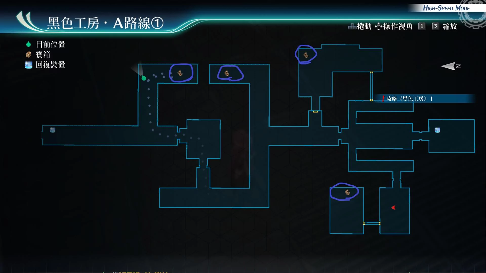
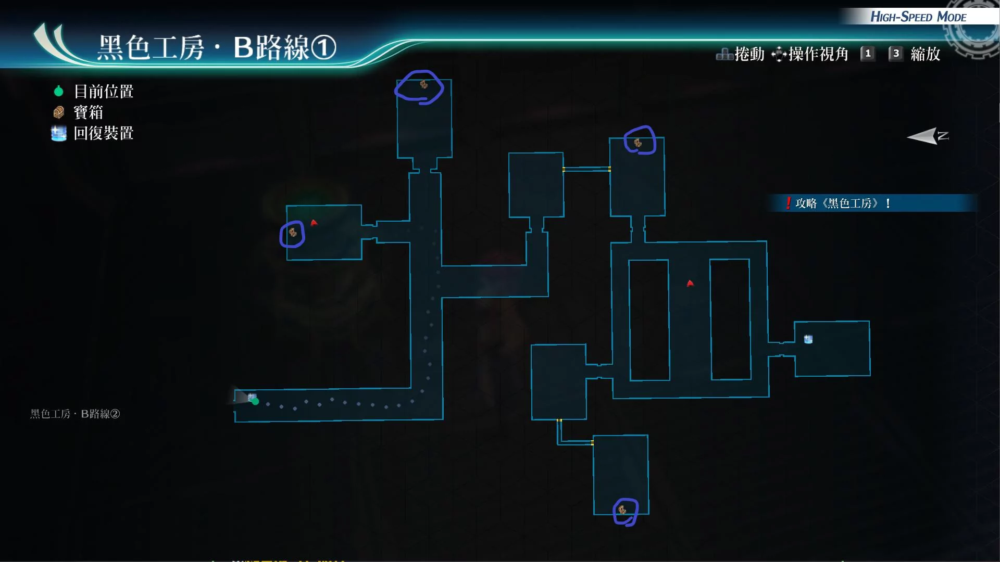
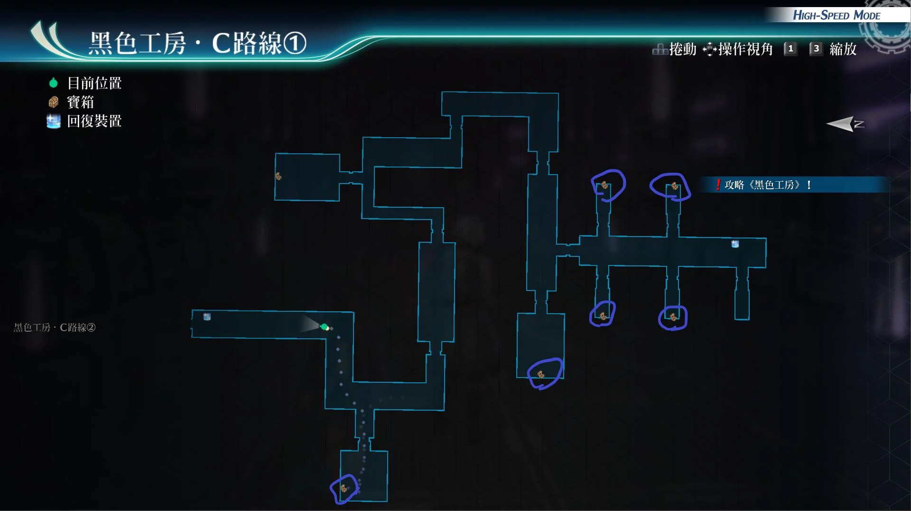
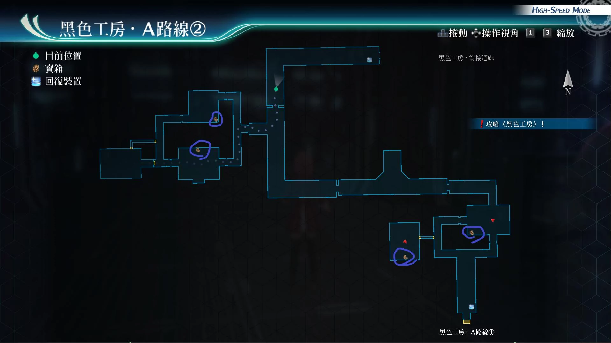
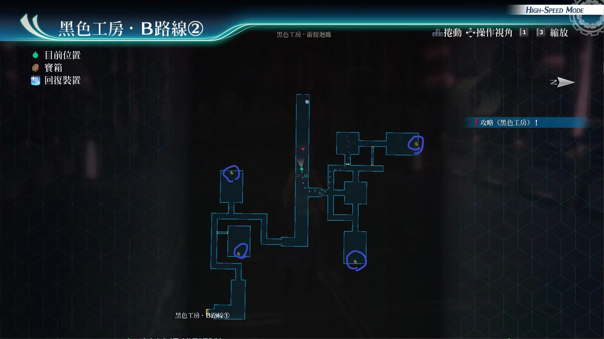
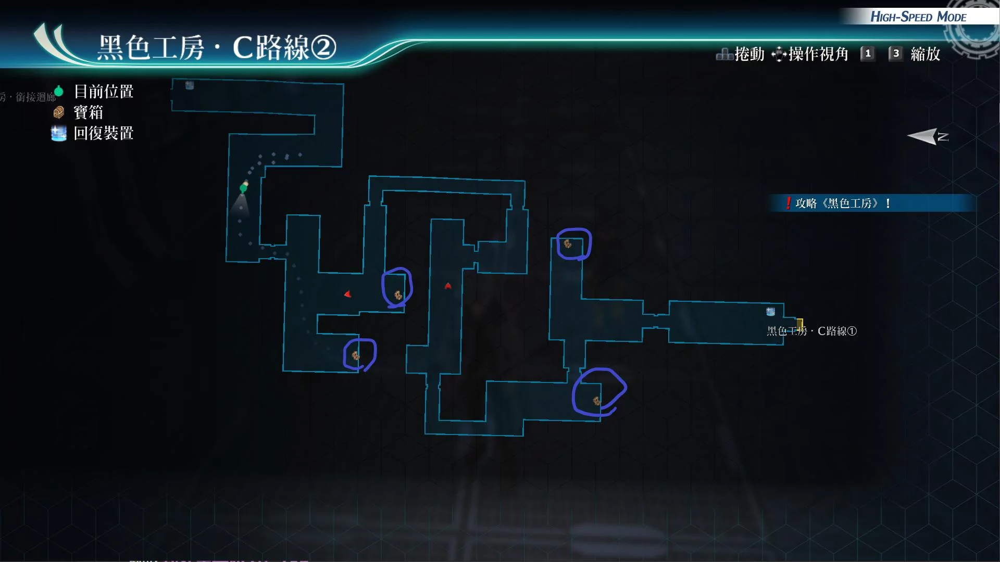

# 黑色工房

---

## 黑色工房·A路线1

- [ ] 黑暗礼服
- [ ] 精灵香
- [ ] 回避3
- [ ] 破坏3

## 黑色工房·B路线1

- [ ] 狩猎防护鞋
- [ ] 全回复药
- [ ] 行动力3
- [ ] 蓝色徽记

## 黑色工房·C路线1

- [ ] 攻击3
- [ ] HP3
- [ ] 绿色徽记
- [ ] EP填充剂IV
- [ ] 黑色徽记
- [ ] 移动3
- [ ] 还魂粉

## 黑色工房·A路线2

- [ ] 夜行高跟鞋
- [ ] 黄色徽记
- [ ] 还魂胶囊
- [ ] 精神3

## 黑色工房·B路线2

- [ ] 黑暗盔甲
- [ ] 命中3
- [ ] 省EP3
- [ ] 龙神香

## 黑色工房·C路线2

- [ ] 必杀3
- [ ] 圣灵药·改
- [ ] 红色徽记
- [ ] 勇气灵魂

## 战斗笔记

- [ ] 基因危机
- [ ] 轻松扳机
- [ ] 日魔脑
- [ ] 器官使魔
- [ ] 战术壳原型机
- [ ] 莹毛虫
- [ ] OZ幻象·红
- [ ] 百臂巨魔
- [ ] OZ幻象·蓝
- [ ] 轻松扳机·G
- [ ] 铜之盖欧尔格
- [ ] 红之罗丝薇瑟
- [ ] 魔弓恩奈雅
- [ ] ???
- [ ] 魔人马克邦
- [ ] 刚毅艾奈丝
- [ ] 钢之雅里安洛德
- [ ] 奥斯本宰相

## 钓鱼笔记

## Boss

# Boss

*OZ幻象·蓝*

需要调查

攻击手段
- 普通攻击：范围攻击
- 偏向装置：单体，str，ats，spd下降
- 磁性光神应答剑：范围加延迟
- 散射太阳神之枪：直线加def和adf下降
- 古老冲刺者：直线加mov下降
- 宝石愈合：范围回复hp，并且str，ars，spd上升
- 米伽勒脚甲：范围攻击加炎伤，物理攻击
- 驱动魔法（水蓝轰炸）：范围封魔
- 半血后亢奋：回复100cp

建议打法1

开着艾玛指令，可以免疫敌方的魔法攻击。悠娜装备时爆的状态，把我方三角色拉上去。然后用时间加速，或者强音之力.复，亚莉莎用天堂赠礼。菲顶着亚莉莎的buff上去闪避反击，或者开隐匿战技回复bp，bp满7，开悠娜指令，等敌方break槽在一半以下，隐匿暴击后，爆裂猛攻，敌方break。之后妙捷指令加时间爆发随便打

建议打法2

套新月镜，悠娜时间爆发加坚韧守护，亚尔缇娜给我方回血和cp，适当的解析弱点。亚莉莎依旧天堂赠礼, 如果对方进入亢奋状态，准备开大的话，我方任意一人先动的状态，替换成艾玛爆S技，带绝对反射2次，然后悠娜拉人后，替补成员换成劳拉，上强音之力.复和魔导祝福后，开她的指令爆S即可，记得最后一名成员换上悠娜拉人防止翻车

---

*OZ幻象·红*

需要调查

攻击手段
- 普通攻击：范围攻击
- 古老冲刺者：直线范围带mov下降
- 重压膝击：范围加晕厥
- 米伽勒腿甲：范围攻击加炎伤
- 宝石愈合：范围回复hp，并且str，ats，spd上升
- 偏向装置：单体，str，ats，spd下降
- 驱动魔法（闪焰蝶）：范围带炎伤
- 半血后亢奋：回复100cp

建议打法1

给库尔特装备好时间驱动和闪耀天启，给我方闪避比较高的角色，全部辅助核心回路，装备库尔特的天狼星核心回路。然后回避反击，就够这两个boss难受了 。之后尤西斯，上白金盾，莎拉雷神功，盖乌斯用S技延迟敌方后。我方第1个行动的成员，换成替补成员的马奇亚斯，然后马奇亚斯时间爆发，拉人战技即可，接着就是很轻松就过了

建议打法2

全员装备运转：堆强音之力.复，马奇亚斯装备时间爆发，开亚修指令，其他3人爆S，马奇亚斯时间爆发拉人战技，替换上后排的成员，再开马奇亚斯指令爆S，之后马奇亚斯再换上场继续拉人

建议打法3

时间驱动后，开太刀风之阵，用马奇亚斯拉人，保证机动性就没有难度

建议打法4

装备防晕厥和炎伤饰品，套新月镜，开艾略特指令，套强音之力复即可，没什么难点

---

*OZ幻象·蓝*, *OZ幻象·红*

攻击手段，比之前多了，链接攻击和连续猛攻

建议打法：

主角自带外挂，全程开着减伤阵即可，血量低的话辅助大回复术

---

*红之罗丝薇瑟*

攻击手段
- 剃刀锐锋：直线范围带解驱动和延迟
- 零之冲击：单体加晕眩攻击
- 龙魂爆发：str和def上升
- 半血后会亢奋，会使用S技

建议打法

此战用亚莉莎的天堂赠礼配合菲的隐匿战技。或者悠娜装备时间爆发，开妙捷指令，链接亚尔缇娜回ep，然后开劳拉指令其他人爆S技，之后拉人，切换成后排成员继续爆S，继续拉人即可。break后，开妙捷指令配合悠娜时间爆发，普通攻击回复bp，把bp留到第2场

---

*铜之盖欧尔格*, *轻松扳机G*

需调查：轻松扳机G, 盖欧尔格

轻松扳机G攻击手段
- 原力场：1次绝对防御以及3回合回血buff
- 光子鱼雷：攻击带封技

盖欧尔格攻击手段
- 召唤小型战术壳：召唤轻松扳机G一体
- 驱动魔法（巨石陨落）：范围def下降
- 蓄力战技（太阳神之枪）：直线范围
- 弱点分析E：单体ats，adf，spd，mov下降
- 半血后亢奋
- 雷电魔枪：范围带晕眩

建议打法

此战带上盖乌斯，莎拉，尤西斯，剩下带马奇亚斯或者库尔特。（此战记得保留库尔特和亚修cp）盖乌斯装备时间爆发，S技延迟敌人即可，之后卖血，莎拉用紫电一闪把boss和小怪吸到一起，尤西斯上白金盾即可，之后马奇亚斯拉人上去，盖乌斯再卖血S技，之后莎拉上时间驱动，库尔特上闪耀天启和新月镜，慢慢磨就是了，中途可开亚修的指令，50%暴击，和str以及spd提升配合强音之力.复和时间驱动，可以瞬间把buff堆到大

---

*刚毅艾奈丝*, *魔弓恩奈雅*, *魔人马克邦*

胜利条件：消耗3人50%hp后3人都会撤退

刚毅攻击手段
- 蓄力战技（裂盔斩）：小范围附加晕厥
- 蓄力战技（刚裂斩）：直线带有延迟，spd和mov下降
- 秩序之盾：自身增加5回合回血buff，以及绝对防御

魔弓攻击手段
- 加速之箭：可以给予敌方同伴拉人效果
- 蓄力战技（穿心箭）：直线带解除驱动，以及链接攻击或连续猛攻
- 蓄力战技（美杜莎之箭）：范围带石化
- 蓄力战技（天使之箭）：范围带混乱

魔人攻击手段
- 开场就会使用过热，让自己进入3回合，亢奋状态，和4回合spd上升，回复hp，和100cp
- 之后就是释放S技：无尽危机（无数猛击）全体带猛火和全取消
- 普通攻击：单体攻击，带炎伤
- 地狱犬：带有猛火和即死异常状态，加全取消，必中技
- 罪恶火焰：范围攻击，带有炎伤状态和全取消
- 魔剑昂巴尔：范围攻击，带炎伤
- 撒旦叶冲击：被此打中，我方全员会强制只剩下200hp，中了必须立马回血

建议打法

此战全程开减伤阵，克洛用时间驱动，杜芭莉用时间爆发，调查情报，并且等到魔人亢奋后，可以提前读大治愈术，中了S技可以直接解除猛火状态，瑟蕾奴的战技，cp可以留着，解除异常状态，她给其他3人上振奋之激，以及用生命之息回复hp然后黎恩用鬼螺旋击，优先打走魔弓和刚毅，只对付魔人一人会轻松很多, 黎恩用鬼螺旋击，打断敌方驱动, 克洛用快捷爆射，打断敌方驱动, 神速用神速太刀，打断敌方驱动，并且读闪耀天启