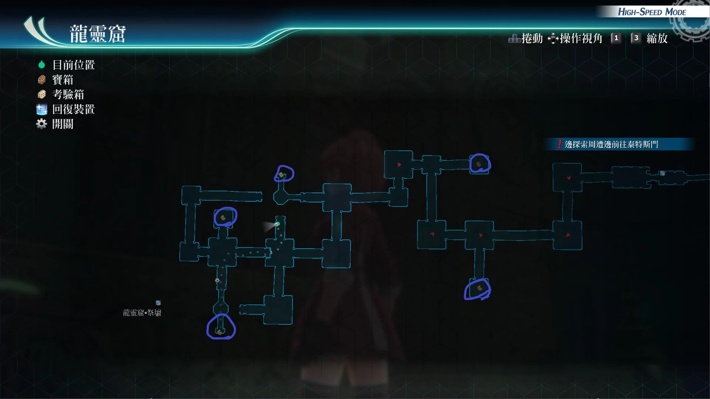

# 龙灵窟

---

## 宝箱

- [ ] [英杰](/game/TheLegendOfHeroes/SenNoKiseki4/quartz/英杰.md#)
- [ ] U物质x5
- [ ] 轻飘飘手巾
- [ ] 七属性耀晶片x50
- [ ] 复仇之箭R

## 考验宝箱

[考验箱003](/game/TheLegendOfHeroes/SenNoKiseki4/ordeal/003.md)

## 战斗笔记

- [ ] 金刚裸海蝶
- [ ] 蜥人族·剑
- [ ] 蜥人族·杖
- [ ] 石化希杜拉
- [ ] 岩石领主

## 钓鱼笔记

## Boss

# Boss

*岩石领主*, *蜥人族·杖*, *蜥人族·剑*

boss攻击手段：

- 普通攻击(吐息攻击)：范围攻击带石化
- 瞬发魔法(刺藤爪)：范围攻击带石化和中毒
- 瞬发岩石之刺：攻击单体

推荐打法：

战前装备放石化和中毒饰品，然后老样子悠娜闪耀天启

库尔特时间驱动，亚尔缇娜这次用，加STR的神圣之力

主要给兰迪和库尔特加buff, 如果悠娜56级，就学会战技：加速之星了，就可以直接拉人了

所以兰迪加到，STR buff，开自己的指令爆S，清小怪之后库尔特S, 亚尔缇娜和悠娜的CP保留

亚尔缇娜可以装备风魔法攻击boss，并且定期帮兰迪回HP